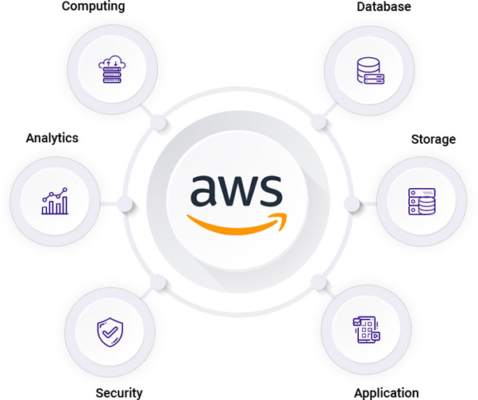

# Introduction to AWS

Welcome to the Introduction to AWS lab! This course is designed for beginners who want to get hands-on experience with the AWS Management Console and the AWS Command Line Interface (CLI). By the end of this lab, you'll know how to navigate AWS interfaces and verify your connection to your AWS account.



## Interfaces

### AWS CLI

The AWS Command Line Interface (CLI) allows you to interact with AWS services using text commands. Let’s take a closer look! Go to your [CLI interface]({{ .STRIGO_GOTO_LAB_0_INTERFACE_0 }}) and try running this command

```bash
aws sts get-caller-identity
```

### AWS Management Console

The AWS Management Console is the web-based interface where you can manage AWS services visually. Open the [AWS Dashboard]({{ .STRIGO_GOTO_LAB_1 }}) and explore the available services
